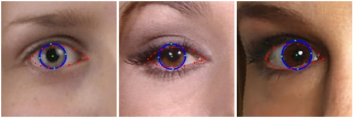

<!--
 * @Author: goog
 * @Date: 2021-07-17 09:33:10
 * @LastEditTime: 2021-08-05 21:09:24
 * @LastEditors: goog
 * @Description: #
 * @FilePath: /GithubSyn/bilibili_opencv/README.md
 * Time Limit Exceeded!
-->
# bilibili_opencv
## Requirement
🌟 opencv-pyhton  
🌟 mediapipe  
🌟 ctypes  
🌟 pycaw      
🌟 autopy    
## [Face Detection](https://google.github.io/mediapipe/solutions/face_detection.html)
- 6 landmarks   
- multi-face support     

## [Face Mesh](https://google.github.io/mediapipe/solutions/face_mesh.html)
- 468 3D face landmarks  
- real-time 

A detector that operates on the full image and computes face locations and a 3D face landmark model that operates on those locations and predicts the approximate surface geometry via regression.   
  

[paper🔗](https://arxiv.org/abs/1907.06724)
## [Iris](https://google.github.io/mediapipe/solutions/iris.html)
- iris
- pupil
- eye contours
- real-time
- Through use of iris landmarks, the solution is also able to determine the **metric distance between the subject and the camera** with relative error less than 10%. 
- **Note:** that iris tracking does **not infer the location** at which people are looking, **nor does it provide any form of identity recognition**.      

  

[paper🔗](https://arxiv.org/abs/2006.11341)
## 21 hand landmarks

## Pose
- 33 3D landmark

## synchronize bilibili [xiao liu time grocery store](https://space.bilibili.com/144585110)  opencv code

【计算机视觉OpenCV】【中英字幕】Opencv实现手部轮廓识别 [code🔗](https://github.com/liuxianyi/bilibili_opencv/blob/main/HandMarkRecognition/HandTrackingMdule.py) [video🔗](https://www.bilibili.com/video/BV1Hv411n7LK?t=146)  
【计算机视觉OpenCV】「中文字幕」手势控制音量 [code🔗](./HandMarkRecognition/VolumeControl.py) [video🔗](https://www.bilibili.com/video/BV1jK4y1u7AB)   
【计算机视觉OpenCV】「中文字幕」手势控制音量**高级** [code🔗](./HandMarkRecognition/VolumeControlAdvance.py) [video🔗](https://www.bilibili.com/video/BV1qM4y1K7Un)    
【计算机视觉OpenCV】「中文字幕」虚拟鼠标**手指控制电脑鼠标** [code🔗](./HandMarkRecognition/AIVirtualMouseProject.py) [video🔗](https://www.bilibili.com/video/BV1ZV411W7T8)   
【计算机视觉OpenCV】「中文字幕」卷积神经网络实现交通标志识别 [<a style="color:red">待更</a>code🔗]() [video🔗](https://www.bilibili.com/video/BV11U4y1379f) [数据集🔗](https://sid.erda.dk/public/archives/daaeac0d7ce1152aea9b61d9f1e19370/published-archive.html)   
【计算机视觉OpenCV】「中文字幕」人脸识别实现**出勤率统计** [<a style="color:red">待更</a>code🔗]() [video🔗](https://www.bilibili.com/video/BV1Dv411J7st) [数据集🔗<a style="color:red">待更</a>]()    
【计算机视觉OpenCV】「中文字幕」目标检测**高精度实时** [<a style="color:red">待更</a>code🔗]() [video🔗](https://www.bilibili.com/video/BV1ZV411H7KS) [数据集🔗<a style="color:red">待更</a>]()    
【计算机视觉OpenCV】「中文字幕」实现背景替换**仿照腾讯会议** [<a style="color:red">待更</a>code🔗]() [video🔗](https://www.bilibili.com/video/BV1vM4y1T765/)    
【计算机视觉OpenCV】「中文字幕」FaceMesh**多个人脸 面部468个关键点** [code🔗](./FaceMesh/FaceMeshMoudle.py) [video🔗](https://www.bilibili.com/video/BV1bb4y1r7n7/)  
【计算机视觉OpenCV】「中文字幕」人脸关键点检测**多个人脸 面部六个关键点** [code🔗](./FaceDetection/FaceDetectionMoudle.py) [video🔗<a style="color:red">待更</a>]()  
【计算机视觉OpenCV】「中文字幕」手指数量识别 [code🔗<a style="color:red">待更</a>]() [video🔗](https://www.bilibili.com/video/BV1Th411z73s/)  
【计算机视觉OpenCV】「中文字幕」创建一个自己的python包 [code🔗<a style="color:red">待更</a>]() [video🔗](https://www.bilibili.com/video/BV1wP4y1t7Hk/)  
【计算机视觉OpenCV】「中文字幕」人脸检测 [code🔗](./FaceDetection/FaceDetectionMoudle.py) [video🔗](https://www.bilibili.com/video/BV1MM4y1N7Zq/)  
【计算机视觉OpenCV】「中文字幕」姿势估计 [code🔗](./FaceDetection/PoseModule.py) [video🔗](https://www.bilibili.com/video/BV1qy4y1j7Gy/)  

## [MediaPipe Python Github🔗](https://github.com/google/mediapipe/tree/master/mediapipe/python)

