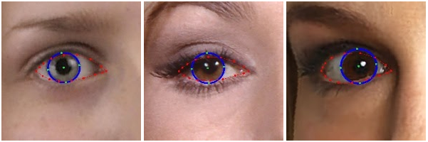
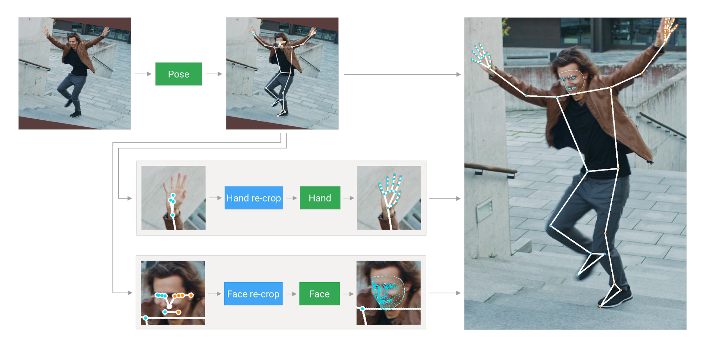

<!--
 * @Author: goog
 * @Date: 2021-07-17 09:33:10
 * @LastEditTime: 2021-08-27 13:37:06
 * @LastEditors: goog
 * @Description: #
 * @FilePath: /GithubSyn/bilibili_opencv/README.md
 * Time Limit Exceeded!
-->
# bilibili_opencv

## Requirement
🌟 opencv-pyhton  
🌟 mediapipe  
🌟 ctypes  
🌟 pycaw      
🌟 autopy    
## [Face Detection](https://google.github.io/mediapipe/solutions/face_detection.html)
- 6 landmarks   
- multi-face support     


## [Face Mesh](https://google.github.io/mediapipe/solutions/face_mesh.html)
- 468 3D face landmarks  
- real-time 

A detector that operates on the full image and computes face locations and a 3D face landmark model that operates on those locations and predicts the approximate surface geometry via regression.   
  

[paper🔗](https://arxiv.org/abs/1907.06724)
## [Iris](https://google.github.io/mediapipe/solutions/iris.html)
- iris
- pupil
- eye contours
- real-time
- Through use of iris landmarks, the solution is also able to determine the **metric distance between the subject and the camera** with relative error less than 10%. 
- **Note:** that iris tracking does **not infer the location** at which people are looking, **nor does it provide any form of identity recognition**.      

  

[paper🔗](https://arxiv.org/abs/2006.11341)
## 21 hand landmarks


## Pose
- 33 3D landmark


## Holistic
- integrate
- pose
- face
- hand
- multi-stage pipeline
- 540+ landmark

步骤：
<ol>
    <li>对整幅图利用pose检测器和landmark检测器å®ç°å§¿æ€ä¼°è®¡</li>
    <li>利用第一步的landmarkè·å–三部分ROI（1. two hands 2. face）</li>
    <li>使用re-crop改进ROI选å–</li>
    <li>è£å‰ª</li>
    <li>使用特定任务模å‹å®ç°faceã€hand估计对应的landmark</li>
    <li>åˆå¹¶æ‰€æœ‰çš„landmark</li>
</ol>

## selfie Segmentation  
- close(<2m) to the camera
- real time  

<video id="video" controls="" preload="none" poster="作者(图片地å€)">
<source id="mp4" src="./resources/selfie_segmentation_web.mp4" type="video/mp4">
</video>

步骤：
<ol>
    <li>two models: general and landscape</li>
    <li>general model: output segmentation mask</li>
    <li>landscape(Background): 1. similar to the general model 2.runs faster</li>
</ol>

## [ObjectDetection](./ObjectDetection)
|类别|class|类别|class|类别|class|类别|class|类别|class|类别|class|类别|class|类别|class|类别|class|类别|class|
|-|-|-|-|-|-|-|-|-|-|-|-|-|-|-|-|-|-|-|-|
|person|人|bicycle|自行车|car|汽车|motorcycle|摩托车|airplane|é£æœº|bus|公共汽车|train|ç«è½¦|truck|å¡è½¦|boat|船|traffic light|交通ç¯|
|fire hydrant|消防栓|street sign|路牌|stop sign|åœè½¦æ ‡å¿—|parking meter|åœè½¦è®¡æ—¶å™¨|bench|长凳|bird|鸟|cat|猫|dog|ç‹—|horse|马|sheep|羊|
|cow|牛|elephant|大象|bear|熊|zebra|斑马|giraffe|长颈鹿|hat|帽å­|backpack|背包|umbrella|雨ä¼|shoe|é‹å­|eye glasses|眼镜|
|handbag|手æ包|tie|领带|suitcase|手æç®±|frisbee|é£ç›˜|skis|滑雪æ¿|snowboard|滑雪æ¿|sports ball|è¿åŠ¨çƒ|kite|é£ç­|baseball bat|棒çƒæ£’|baseball glove|棒çƒæ‰‹å¥—|
|skateboard|滑æ¿|surfboard|冲浪æ¿|tennis racket|网çƒæ‹|bottle|瓶å­|plate|盘|wine glass|é…’æ¯|cup|æ¯å­|fork|å‰å­|knife|刀|spoon|勺å­|
|bowl|碗|banana|香蕉|apple|苹æœ|sandwich|三æ˜æ²»|orange|æ©™å­|broccoli|西兰花|carrot|胡èåœ|hot dog|热狗|pizza|披è¨|donut|甜甜圈|
|cake|蛋糕|chair|椅å­|couch|æ²™å‘|potted plant|盆栽|bed|床|mirror|é•œå­|dining table|é¤æ¡Œ|window|窗户|desk|书桌|toilet|å•æ‰€|
|door|é—¨|tv|电视|laptop|笔记本电脑|mouse|é¼ æ ‡|remote|é¥æ§å™¨|keyboard|键盘|cell phone|手机|microwave|微波炉|oven|烤箱|toaster|烤é¢åŒ…机|
|sink|水槽|refrigerator|冰箱|blender|æ…拌机|book|书|clock|时钟|vase|花瓶|scissors|剪刀|teddy bear|泰迪熊|hair drier|å¹é£æœº|toothbrush|牙刷|
|hair brush|毛刷|

## [Face Recognition](./FaceAttendance)
```python
import cv2
import numpy as np
import face_recognition
```
本项目face_recognition是一个强大ã€ç®€å•ã€æ˜“上手的人脸识别开æºé¡¹ç›®ï¼Œå¹¶ä¸”é…备了完整的开å‘文档和应用案例，特别是兼容树è“派系统。
[â¡ï¸more Details](https://github.com/ageitgey/face_recognition/blob/master/README_Simplified_Chinese.md)


## synchronize bilibili [xiao liu time grocery store](https://space.bilibili.com/144585110)  opencv code
ã€è®¡ç®—机视觉OpenCV】ã€ä¸­è‹±å­—幕】Opencvå®ç°æ‰‹éƒ¨è½®å»“识别 [code🔗](https://github.com/liuxianyi/bilibili_opencv/blob/main/HandMarkRecognition/HandTrackingMdule.py) [video🔗](https://www.bilibili.com/video/BV1Hv411n7LK?t=146)  
ã€è®¡ç®—机视觉OpenCV】「中文字幕ã€æ‰‹åŠ¿æ§åˆ¶éŸ³é‡ [code🔗](./HandMarkRecognition/VolumeControl.py) [video🔗](https://www.bilibili.com/video/BV1jK4y1u7AB)   
ã€è®¡ç®—机视觉OpenCV】「中文字幕ã€æ‰‹åŠ¿æ§åˆ¶éŸ³é‡**高级** [code🔗](./HandMarkRecognition/VolumeControlAdvance.py) [video🔗](https://www.bilibili.com/video/BV1qM4y1K7Un)    
ã€è®¡ç®—机视觉OpenCV】「中文字幕ã€è™šæ‹Ÿé¼ æ ‡**手指æ§åˆ¶ç”µè„‘é¼ æ ‡** [code🔗](./HandMarkRecognition/AIVirtualMouseProject.py) [video🔗](https://www.bilibili.com/video/BV1ZV411W7T8)   
ã€è®¡ç®—机视觉OpenCV】「中文字幕ã€å·ç§¯ç¥ç»ç½‘络å®ç°äº¤é€šæ ‡å¿—识别 [train code🔗](./TrafficSignClassifation/TrainCode.py) [test code🔗](./TrafficSignClassifation/TestCode.py)[video🔗](https://www.bilibili.com/video/BV11U4y1379f) [æ•°æ®é›†ğŸ”— æå–ç : 39q4](https://pan.baidu.com/s/15v14ieSPZntBTDzKVckEgA)   
ã€è®¡ç®—机视觉OpenCV】「中文字幕ã€äººè„¸è¯†åˆ«å®ç°**出勤ç‡ç»Ÿè®¡** [code🔗](./FaceAttendance/recognition.py) [video🔗](https://www.bilibili.com/video/BV1Dv411J7st)    
ã€è®¡ç®—机视觉OpenCV】「中文字幕ã€ç›®æ ‡æ£€æµ‹**高精度å®æ—¶** [code🔗](./ObjectDetection/detection.py) [éæ大值抑制code🔗](./ObjectDetection/NMSDetection.py)[video🔗](https://www.bilibili.com/video/BV1ZV411H7KS) [训练模å‹ğŸ”—æå–ç : mvxs](https://pan.baidu.com/s/1gr_2bl8zlYHF6cG-K3JVZw)    
ã€è®¡ç®—机视觉OpenCV】「中文字幕ã€å®ç°èƒŒæ™¯æ›¿æ¢**仿照腾讯会议** [<a style="color:red">å¾…æ›´</a>code🔗]() [video🔗](https://www.bilibili.com/video/BV1vM4y1T765/)    
ã€è®¡ç®—机视觉OpenCV】「中文字幕ã€FaceMesh**多个人脸 é¢éƒ¨468个关键点** [code🔗](./FaceMesh/FaceMeshMoudle.py) [video🔗](https://www.bilibili.com/video/BV1bb4y1r7n7/)  
ã€è®¡ç®—机视觉OpenCV】「中文字幕ã€äººè„¸å…³é”®ç‚¹æ£€æµ‹**多个人脸 é¢éƒ¨å…­ä¸ªå…³é”®ç‚¹** [code🔗](./FaceDetection/FaceDetectionMoudle.py)   
ã€è®¡ç®—机视觉OpenCV】「中文字幕ã€æ‰‹æŒ‡æ•°é‡è¯†åˆ« [code🔗](./FingerDount/count.py) [video🔗](https://www.bilibili.com/video/BV1Th411z73s/)  
ã€è®¡ç®—机视觉OpenCV】「中文字幕ã€åˆ›å»ºä¸€ä¸ªè‡ªå·±çš„python包 [code🔗<a style="color:red">å¾…æ›´</a>]() [video🔗](https://www.bilibili.com/video/BV1wP4y1t7Hk/)  
ã€è®¡ç®—机视觉OpenCV】「中文字幕ã€äººè„¸æ£€æµ‹ [code🔗](./FaceDetection/FaceDetectionMoudle.py) [video🔗](https://www.bilibili.com/video/BV1MM4y1N7Zq/)  
ã€è®¡ç®—机视觉OpenCV】「中文字幕ã€å§¿åŠ¿ä¼°è®¡ [code🔗](./PoseEstimation/PoseModule.py) [video🔗](https://www.bilibili.com/video/BV1qy4y1j7Gy/)  

## [MediaPipe Python Github🔗](https://github.com/google/mediapipe/tree/master/mediapipe/python)


